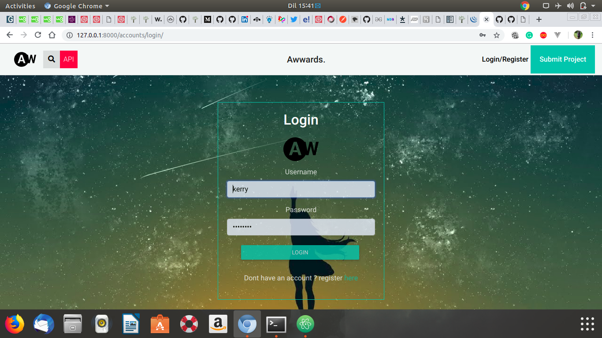

# Awards Application
#### This is a Python web application using Django  framework and Postgresql,RESTful API,2019
#### By **[Collins kipkemoi](https://github.com/kipkemoimayor)**
## Description
This is a web application handcrafted and developed using Django framework, This app allows users to register and Share their best art of work web development. Once a user has posted the website or app to be reviewed, The app is reviewed in three categories Content,Usability and design

## Setup/Installation Requirements
* A PC mainly with an Operating system.
* Python3.6 or later is installed in your PC.
* Postgresql installed
* clone the directory into your local machine
* navigate to the cloned folder by `cd Awards`
* Create a virtual environment
* run `source virtual/bin/activate`
* install Django `pip install django=1.11`
* pip install `requirements.txt`
* run `python3.6 manage.py runserver `
* The application should work
* for the test run `python manage.py test award`
# API
This application has two main API end-points
The profile end-point `https://awardnation.herokuapp.com/api/profile/`
The projects end-point `https://awardnation.herokuapp.com/api/projects/`
## Known Bugs
NO known bugs as at the moment please reach to us if you see any.
## Behavior Driven Development

| __Behavior__  | __Input example__ | __Output example__ |
| ------------- | ----------------- | ------------------ |
| The user should see the landing page on first sight | "https://www.awards.com"   | Home  |
| The application should provide an option to register or login to the app | login/register | true  |
| The application should authenticate Users base on details the user provides   | password/username |  access or no access |
| The user should be redirected to home page once logged in | access | home page |
| The user should view different views or post or and projects from different people | --- | Projects |
| The application should be able to restrict unauthorized users from accessing some parts of the application | view | true/false |
| The user should be able to update his/her profile any time | profile update | True |
| The user should be able to view other users who have rated the project | rate | all list |
| The user should be able to review and rate other projects  | rate/review | True |
| The user should be able to logout at will | logout | True |

## Technologies Used
## main languages used are
* Python
* Material design
* WhiteNoise
* Django rest_framework
* JavaScript
* CSS
* Django
* PostgreSQL Database

## Support and contact details
Email collinskipkemoi24@gmail.com
### License
*License is under MIT 2019*
view Full License here [MIT](LICENSE)
Copyright (c) 2019 **collins kipkemoi**
This software is free to use and distribute, Therefore all rights and given to any user to modify and either use for Commercial purpose or local purpose.
